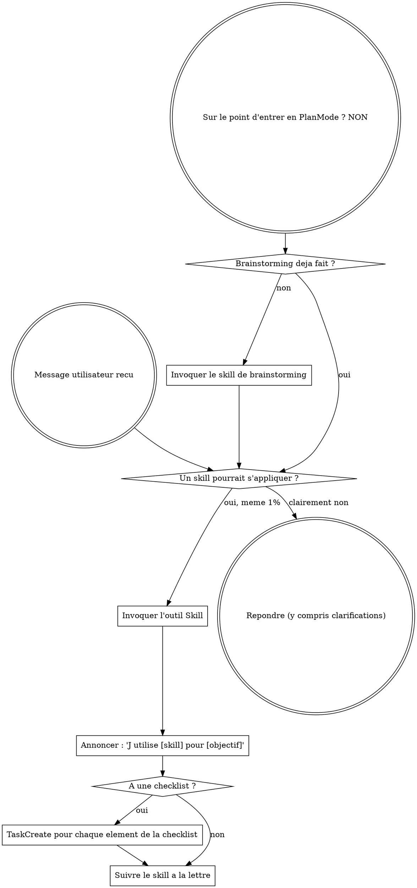

> Fork de [pcvelz/superpowers](https://github.com/pcvelz/superpowers) — traduit integralement en francais.

<SUBAGENT-STOP>
Si tu as ete lance comme sous-agent pour executer une tache specifique, ignore ce skill.
</SUBAGENT-STOP>

<EXTREMELY-IMPORTANT>
Si tu penses qu'il y a ne serait-ce que 1% de chance qu'un skill s'applique a ce que tu fais, tu DOIS ABSOLUMENT invoquer le skill.

SI UN SKILL S'APPLIQUE A TA TACHE, TU N'AS PAS LE CHOIX. TU DOIS L'UTILISER.

Ce n'est pas negociable. Ce n'est pas optionnel. Tu ne peux pas rationaliser pour t'en sortir.
</EXTREMELY-IMPORTANT>

## Priorite des instructions

Les skills Superpowers remplacent le comportement par defaut du system prompt, mais **les instructions de l'utilisateur ont toujours la priorite** :

1. **Instructions explicites de l'utilisateur** (CLAUDE.md, GEMINI.md, AGENTS.md, demandes directes) — priorite maximale
2. **Skills Superpowers** — remplacent le comportement systeme par defaut quand il y a conflit
3. **System prompt par defaut** — priorite minimale

Si CLAUDE.md, GEMINI.md ou AGENTS.md dit "pas de TDD" et qu'un skill dit "toujours utiliser TDD", suis les instructions de l'utilisateur. C'est l'utilisateur qui decide.

## Comment acceder aux skills

**Dans Claude Code :** Utilise l'outil `Skill`. Quand tu invoques un skill, son contenu est charge et presente — suis-le directement. N'utilise jamais l'outil Read sur les fichiers de skills.

**Dans Copilot CLI :** Utilise l'outil `skill`. Les skills sont auto-decouverts depuis les plugins installes. L'outil `skill` fonctionne comme l'outil `Skill` de Claude Code.

**Dans Gemini CLI :** Les skills s'activent via l'outil `activate_skill`. Gemini charge les metadonnees des skills au demarrage de session et active le contenu complet a la demande.

**Dans d'autres environnements :** Consulte la documentation de ta plateforme pour savoir comment les skills sont charges.

## Adaptation par plateforme

Les skills utilisent les noms d'outils de Claude Code. Plateformes non-CC : voir `references/copilot-tools.md` (Copilot CLI), `references/codex-tools.md` (Codex) pour les equivalences d'outils. Les utilisateurs Gemini CLI recoivent le mapping d'outils automatiquement via GEMINI.md.

# Utiliser les skills

## La regle

**Invoquer les skills pertinents ou demandes AVANT toute reponse ou action.** Meme 1% de chance qu'un skill s'applique = l'invoquer pour verifier. Si le skill invoque ne colle pas a la situation, pas besoin de l'utiliser.

## Red flags

Ces pensees signifient STOP — tu es en train de rationaliser :

| Pensee | Realite |
|--------|---------|
| "C'est juste une question simple" | Les questions sont des taches. Verifier les skills. |
| "J'ai besoin de plus de contexte d'abord" | Le check des skills vient AVANT les questions de clarification. |
| "Laisse-moi explorer la codebase d'abord" | Les skills te disent COMMENT explorer. Verifier d'abord. |
| "Je peux checker git/les fichiers rapidement" | Les fichiers n'ont pas le contexte de la conversation. Verifier les skills. |
| "Laisse-moi d'abord rassembler des infos" | Les skills te disent COMMENT rassembler les infos. |
| "Pas besoin d'un skill formel pour ca" | Si un skill existe, l'utiliser. |
| "Je me souviens de ce skill" | Les skills evoluent. Lire la version actuelle. |
| "Ca ne compte pas comme une tache" | Action = tache. Verifier les skills. |
| "Le skill est excessif pour ca" | Les trucs simples deviennent complexes. L'utiliser. |
| "Je vais juste faire ce truc d'abord" | Verifier AVANT de faire quoi que ce soit. |
| "Ca a l'air productif la" | L'action sans methode fait perdre du temps. Les skills empechent ca. |
| "Je sais ce que ca veut dire" | Connaitre le concept != utiliser le skill. L'invoquer. |

## Priorite des skills

Quand plusieurs skills pourraient s'appliquer, utiliser cet ordre :

1. **Skills de processus d'abord** (brainstorming, debugging) — ils determinent COMMENT aborder la tache
2. **Skills d'implementation ensuite** (frontend-design, mcp-builder) — ils guident l'execution

"Construis X" → brainstorming d'abord, puis skills d'implementation.
"Corrige ce bug" → debugging d'abord, puis skills specifiques au domaine.

## Types de skills

**Rigides** (TDD, debugging) : suivre a la lettre. Ne pas adapter pour esquiver la discipline.

**Flexibles** (patterns) : adapter les principes au contexte.

Le skill lui-meme te dit lequel il est.

## Instructions utilisateur

Les instructions disent QUOI, pas COMMENT. "Ajoute X" ou "Corrige Y" ne veut pas dire sauter les workflows.
